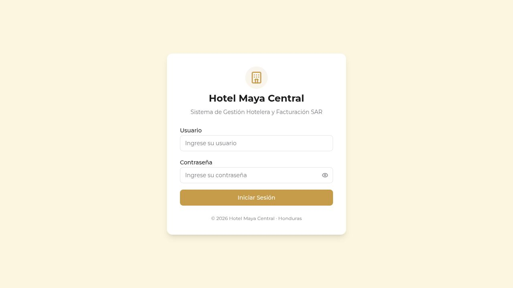
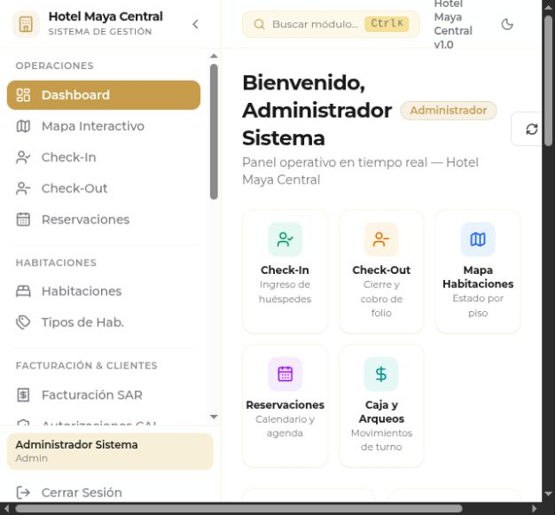
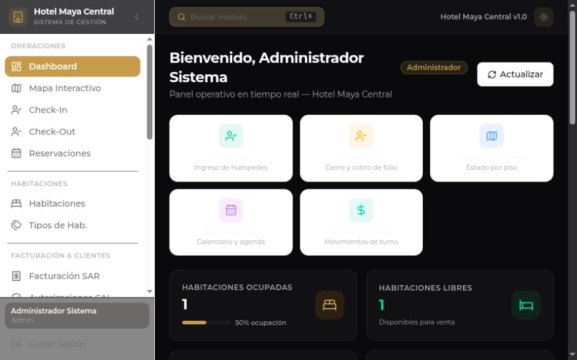
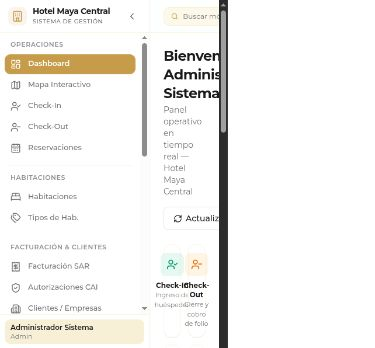

# Frontend y experiencia de usuario

### UX-01 · P1 · Menú fijo impide trabajar con comodidad en pantallas estrechas

**Ubicación:** [frontend/src/components/layout/Sidebar.tsx:111](/home/vm/Projects/erp-hotel/frontend/src/components/layout/Sidebar.tsx:111); [frontend/src/components/layout/AppLayout.tsx:33](/home/vm/Projects/erp-hotel/frontend/src/components/layout/AppLayout.tsx:33)

**Evidencia y alcance:** Captura dashboard-movil.png: sidebar abierto de 256 px en viewport 390 px; medición DOM previa width 390, scrollWidth 575. No hay drawer/breakpoint del shell; el contenido queda comprimido y desborda. Sí existen breakpoints dentro de numerosas páginas.

**Impacto:** El personal que use tableta/móvil o zoom pierde acceso legible a operaciones. Afecta reflowWCAG 1.4.10; no se hizo certificación completa WCAG.

**Corrección propuesta:** Menú como drawer en anchuras pequeñas, cerrado inicialmente y con foco controlado; main sin margen fijo cuando sea overlay. Mantener tablas con desplazamiento propio y acciones visibles. $impeccable adapt.

**Criterio de cierre:** 320/390/768 px y zoom 200%: sin scroll horizontal de toda la página, navegación y tareas esenciales accesibles.

### UX-02 · P1 · Contraste insuficiente en botones y estados de habitación

**Ubicación:** [frontend/src/index.css:13](/home/vm/Projects/erp-hotel/frontend/src/index.css:13); [frontend/src/pages/admin/AuditLogsPage.tsx:159](/home/vm/Projects/erp-hotel/frontend/src/pages/admin/AuditLogsPage.tsx:159); [frontend/src/pages/rooms/FloorMapPage.tsx:131](/home/vm/Projects/erp-hotel/frontend/src/pages/rooms/FloorMapPage.tsx:131)

**Evidencia y alcance:** Cálculo sRGB del color sólido blanco sobre#C69C4B y sobre verde#22c55e/amarillo#eab308 del mapa queda por debajo de 4.5:1 para texto normal. El mapa muestra estado principalmente como color antes de abrir detalle; faltan estados Limpieza/Bloqueada en su leyenda.

**Impacto:** Baja legibilidad para recepcionistas con visión reducida y ambigüedad de estado para daltonismo. WCAG 1.4.3 y uso del color1.4.1.

**Corrección propuesta:** Tokens accesibles por tema y pareja fondo/texto con contraste comprobado; estado textual en cada cuarto, leyenda completa. Preservar dorado como acento de marca. $impeccable colorize.

**Criterio de cierre:** Texto normal≥4.5:1 y grande≥3:1 en ambos temas; estado comprensible en escala de grises.

### UX-03 · P1 · Etiquetas, iconos y selección contable no son accesibles por teclado

**Ubicación:** [frontend/src/pages/auth/LoginPage.tsx:60](/home/vm/Projects/erp-hotel/frontend/src/pages/auth/LoginPage.tsx:60); [frontend/src/pages/accounting/JournalEntriesPage.tsx:34](/home/vm/Projects/erp-hotel/frontend/src/pages/accounting/JournalEntriesPage.tsx:34); [frontend/src/components/ui/Pagination.tsx:56](/home/vm/Projects/erp-hotel/frontend/src/components/ui/Pagination.tsx:56)

**Evidencia y alcance:** Labels visuales sin htmlFor/id en login y muchos formularios; mostrar contraseña/cerrar modales sin nombre accesible. AccountCombobox usa div/onMouseDown sin roles, tabIndex ni manejo de teclado. Selector de tamaño de página no tiene etiqueta asociada.

**Impacto:** Dificulta lectores de pantalla y puede impedir crear asientos sin ratón. Relacionado con WCAG 1.3.1, 2.1.1, 4.1.2.

**Corrección propuesta:** Controles nativos o combobox accesible, ids/labels y errores asociados; nombres y estados aria de iconos. Foco visible también en acciones que hoy aparecen solo con hover. $impeccable harden.

**Criterio de cierre:** Crear asiento, autenticar y paginar usando solo Tab/ShiftTab/Enter/Escape, con lector de pantalla anunciando nombre, error y estado.

### UX-04 · P1 · Modales carecen de un patrón consistente de foco y cierre

**Ubicación:** [frontend/src/components/ui/ConfirmDialog.tsx:47](/home/vm/Projects/erp-hotel/frontend/src/components/ui/ConfirmDialog.tsx:47); [frontend/src/components/layout/CommandPalette.tsx:107](/home/vm/Projects/erp-hotel/frontend/src/components/layout/CommandPalette.tsx:107); [frontend/src/pages/rooms/FloorMapPage.tsx:147](/home/vm/Projects/erp-hotel/frontend/src/pages/rooms/FloorMapPage.tsx:147)

**Evidencia y alcance:** ConfirmDialog tiene role y título, pero no trap/retorno de foco ni Escape; múltiples modales manuales ni siquiera tienen semántica dialog. Fondo clicable puede cerrar durante envío. Paleta sí maneja Escape, pero no establece navegación completa de opciones.

**Impacto:** Foco puede ir a controles de fondo; cierre inesperado pierde contexto o hace dudar si una operación terminó. PatrónAPG dialog y WCAG 2.4.3/4.1.2.

**Corrección propuesta:** Un componente de diálogo accesible común: foco inicial/encerrado/retorno, Escape según estado, inert del fondo y bloqueo coherente en envío. $impeccable harden.

**Criterio de cierre:** Abrir/cerrar vuelve al disparador; Tab no sale al fondo; la operación en curso no queda sin estado visible.

### UX-05 · P1 · Botones de notas, cargos y autorizaciones no coinciden con el contrato API

**Ubicación:** [frontend/src/pages/invoices/InvoicesPage.tsx:179](/home/vm/Projects/erp-hotel/frontend/src/pages/invoices/InvoicesPage.tsx:179); [frontend/src/pages/folios/FoliosPage.tsx:41](/home/vm/Projects/erp-hotel/frontend/src/pages/folios/FoliosPage.tsx:41); [frontend/src/pages/invoices/AuthorizationsPage.tsx:93](/home/vm/Projects/erp-hotel/frontend/src/pages/invoices/AuthorizationsPage.tsx:93)

**Evidencia y alcance:** Código: nota crédito usa ruta/invoices/credit-note en vez de/invoices/{id}/credit-note. Añadir consumo desde Folios/Checkout omiteFolioId requerido por DTO. Autorización envía timestampISO a DateOnly; abrir PDF conwindow.open no aporta bearer. Source=document se filtra luego como docauth. La ruta de anulación visible está rechazada por diseño del backend.

**Impacto:** Acciones principales fallan aun después de corregir compilación, con mensajes genéricos; bloquea cargos/notas/gestión fiscal. Hay evidencia API independiente en DB-04.

**Corrección propuesta:** Contrato único tipado generado desde Open API; pruebas de integración por acción de pantalla. Eliminar acciones incompatibles y descargar adjuntos vía cliente autenticado. $impeccable harden.

**Criterio de cierre:** Cada botón produce la ruta/cuerpo esperado; cargo queda visible, nota se vincula al original, PDF abre autorizado y filtro de autorización funciona.

### UX-06 · P1 · Checkout calcula y envía datos fiscales incompatibles

**Ubicación:** [frontend/src/pages/reservations/CheckOutPage.tsx:188](/home/vm/Projects/erp-hotel/frontend/src/pages/reservations/CheckOutPage.tsx:188); [frontend/src/pages/reservations/CheckOutPage.tsx:133](/home/vm/Projects/erp-hotel/frontend/src/pages/reservations/CheckOutPage.tsx:133); [frontend/src/pages/reservations/CheckOutPage.tsx:91](/home/vm/Projects/erp-hotel/frontend/src/pages/reservations/CheckOutPage.tsx:91)

**Evidencia y alcance:** TaxpayerType=Empresa al introducir RTN no coincide con valores admitidos por backend. Se envían propiedades de pago no soportadas por CreateInvoice DTO; cálculos duplicados ignoran descuentos de línea o interpretan fijo como porcentaje. Error del movimiento de caja se descarta. Selección de nuevo huésped no reinicia todo el estado de pago/RTN.

**Impacto:** Cobro rechazado para empresas o con impuestos/caja erróneos, y posible aplicación de datos del huésped anterior.

**Corrección propuesta:** Cotización y liquidación autoritativas de servidor con DTO compartido; limpiar estado por reserva y tratar flujo como una única operación con resultado integral. $impeccable harden.

**Criterio de cierre:** Empresa con RTN, consumidor, exento, descuento fijo y cambio dehuésped: importes correctos, sin datos arrastrados ni éxito parcial.

### UX-07 · P1 · La acción de ingresar una reserva no conserva la reserva seleccionada

**Ubicación:** [frontend/src/pages/reservations/ReservationsPage.tsx:73](/home/vm/Projects/erp-hotel/frontend/src/pages/reservations/ReservationsPage.tsx:73); [frontend/src/pages/reservations/CheckInPage.tsx:140](/home/vm/Projects/erp-hotel/frontend/src/pages/reservations/CheckInPage.tsx:140)

**Evidencia y alcance:** La lista navega/checkin sin identificador; wizard crea otra reserva. El guardado de huésped puede fallar y aun avanzar. No hay implementación completa del calendario que promete el acceso de Dashboard.

**Impacto:** El recepcionista pierde la reserva preparada, repite datos o genera otra operación; mayor demora justo en llegada.

**Corrección propuesta:** Ruta/checkin?reservationId=... oparam explícito, precargar reserva y actualizar la misma; avanzar solo después de validación/guardado exitoso. Mostrar agenda real o nombrar vista como lista. $impeccable shape.

**Criterio de cierre:** Desde reserva existente el check-in conservaId, cuarto, fechas y anticipo, no crea otra y permite volver sin perder datos.

### UX-08 · P1 · Errores y cargas se presentan como cero, vacío o éxito

**Ubicación:** [frontend/src/pages/accounting/TrialBalancePage.tsx:20](/home/vm/Projects/erp-hotel/frontend/src/pages/accounting/TrialBalancePage.tsx:20); [frontend/src/pages/reports/ReportsPage.tsx:302](/home/vm/Projects/erp-hotel/frontend/src/pages/reports/ReportsPage.tsx:302); [frontend/src/pages/invoices/InvoiceEditPage.tsx:45](/home/vm/Projects/erp-hotel/frontend/src/pages/invoices/InvoiceEditPage.tsx:45); [frontend/src/pages/settings/SettingsPage.tsx:68](/home/vm/Projects/erp-hotel/frontend/src/pages/settings/SettingsPage.tsx:68)

**Evidencia y alcance:** TrialBalance no captura error de carga; inicial vacío puede parecer balance cero. Reportes muestran0 antes de tener respuesta y retienen resultados anteriores al cambiar filtros. InvoiceEdit oculta alerta cuando!invoice y quedaCargando. Settings silencia cargas y no presenta todos los fallos de guardado.

**Impacto:** Cero se interpreta como ausencia de obligaciones y el usuario puede trabajar con resultados de otro período o configuración no guardada.

**Corrección propuesta:** Estados explícitos cargando/sin datos/error/desactualizado/guardado; mostrar período aplicado a los resultados, invalidar o marcar al cambiar filtros. Mantener datos solo si se indica su antigüedad. $impeccable harden.

**Criterio de cierre:** Simular 500, desconexión y respuesta lenta por pantalla: nunca se anuncia cero/éxito sin confirmación y siempre hay reintento.

### UX-09 · P2 · Búsquedas y paginación generan carreras y trabajo innecesario

**Ubicación:** [frontend/src/pages/guests/GuestsPage.tsx:78](/home/vm/Projects/erp-hotel/frontend/src/pages/guests/GuestsPage.tsx:78); [frontend/src/pages/customers/CustomersPage.tsx:70](/home/vm/Projects/erp-hotel/frontend/src/pages/customers/CustomersPage.tsx:70); [frontend/src/lib/axios.ts:8](/home/vm/Projects/erp-hotel/frontend/src/lib/axios.ts:8)

**Evidencia y alcance:** Búsqueda lanza solicitud por cada carácter, sin debounce/cancelación y luego vuelve a filtrar localmente. Respuestas fuera deorden pueden sobrescribir resultados. Paginación local con valor inicial de 15 mientras selector ofrece otros tamaños. Cliente HTTP no define timeout global.

**Impacto:** Resultados saltan, aumenta carga de BD y la UIpuede esperar indefinidamente. Listar15 filas no significa descargar15 registros.

**Corrección propuesta:** Debounce y AbortSignal, paginación real de servidor y filtros coherentes, reset/clamp de página. Usar ReactQuery ya instalado para caché, invalidación y estados. $impeccable optimize.

**Criterio de cierre:** Escribirconsulta rápida con respuestas reordenadas deja solo resultados de última consulta; ninguna página queda vacía fuera de rango.

### UX-10 · P2 · Navegación, permisos y atajos prometidos no están alineados

**Ubicación:** [frontend/src/components/layout/CommandPalette.tsx:151](/home/vm/Projects/erp-hotel/frontend/src/components/layout/CommandPalette.tsx:151); [frontend/src/components/layout/Breadcrumbs.tsx:34](/home/vm/Projects/erp-hotel/frontend/src/components/layout/Breadcrumbs.tsx:34); [frontend/src/App.tsx:19](/home/vm/Projects/erp-hotel/frontend/src/App.tsx:19); [frontend/src/components/layout/Sidebar.tsx:50](/home/vm/Projects/erp-hotel/frontend/src/components/layout/Sidebar.tsx:50)

**Evidencia y alcance:** Paleta anunciaEnter para seleccionar pero carece de manejador de selección por Enter/flechas. Búsqueda literal no encuentra facturas con el texto deejemplo si el módulo se llamaFacturación. Breadcrumbs genera padres/accounting y detalles no declarados. MenúHuéspedes permiteContador mientras ruta loexcluye. Los alias Recepcion/Recepcionista sí se normalizan: no son el fallo.

**Impacto:** Atajos poco fiables, enlaces404 y acciones que terminan en denegación; fricción repetida en trabajo diario.

**Corrección propuesta:** Una definición de rutas/metadatos/permisos para menú, paleta, breadcrumb; búsqueda por sinónimos y teclado completo. $impeccable clarify.

**Criterio de cierre:** Todos los enlaces corresponden a rutas válidas y permisos;facturas encuentra Facturación; flechas y Enter abren opción correcta.

### UX-11 · P2 · Acciones duplicables y validación inconsistente entre capas

**Ubicación:** [frontend/src/pages/discounts/DiscountsPage.tsx:43](/home/vm/Projects/erp-hotel/frontend/src/pages/discounts/DiscountsPage.tsx:43); [frontend/src/pages/rooms/RoomTypesPage.tsx:41](/home/vm/Projects/erp-hotel/frontend/src/pages/rooms/RoomTypesPage.tsx:41); [frontend/src/pages/users/UsersPage.tsx:94](/home/vm/Projects/erp-hotel/frontend/src/pages/users/UsersPage.tsx:94)

**Evidencia y alcance:** Varios formularios permiten pulsarGuardar varias veces sin indicador/disabled (descuentos, tipos, habitaciones, caja). Usuario acepta contraseña de 6 caracteres en frontend frente a 8 en backend. Errores esperan response.data.message aunque API devuelve string o ValidationProblemDetails.

**Impacto:** Duplicados, errores genéricos y retrabajo; la indicación visual de guardado varía de un módulo a otro.

**Corrección propuesta:** Estado de envío uniforme, idempotencia de servidor para operaciones financieras, restricciones compartidas y traducción centralizada de errores. $impeccable harden.

**Criterio de cierre:** Doble clic no duplica; contraseña inválida se explica antes/después; errors DTO resaltan el campo correspondiente.

### UX-12 · P2 · La interfaz afirma funciones que no están implementadas o comprobadas

**Ubicación:** [frontend/src/pages/reports/ReportsPage.tsx:364](/home/vm/Projects/erp-hotel/frontend/src/pages/reports/ReportsPage.tsx:364); [frontend/src/pages/admin/AuditLogsPage.tsx:148](/home/vm/Projects/erp-hotel/frontend/src/pages/admin/AuditLogsPage.tsx:148); [frontend/src/pages/dashboard/DashboardPage.tsx:78](/home/vm/Projects/erp-hotel/frontend/src/pages/dashboard/DashboardPage.tsx:78)

**Evidencia y alcance:** BotónDescargar Formato Guía PDF no tiene onClick. Copyinmutable contradiceSEG-06/07. Dashboard/mapa se actualizan bajo solicitud, no por canal en tiempo real. Casillas DMR-1 están codificadas sin fuente/versionado fiscal en proyecto.

**Impacto:** Personal confía en controles o actualizaciones inexistentes; la guía fiscal puede confundirse con declaración validada.

**Corrección propuesta:** Implementar acción o retirarla; indicar última actualización y límites reales de bitácora/reportes. Revisar formato DMR-1 con documentación oficial y contador; mostrar borrador yversión. $impeccable clarify.

**Criterio de cierre:** Ningún botón inactivo sin explicación; descripciones coinciden con comportamiento y reportes muestran fecha/período/fuente aplicados.

### UX-13 · P2 · Previsualización de impresión ignora cambios aún no guardados

**Ubicación:** [frontend/src/pages/settings/SettingsPage.tsx:74](/home/vm/Projects/erp-hotel/frontend/src/pages/settings/SettingsPage.tsx:74); [backend/src/hotel-erp.Api/Controllers/PrintController.cs:46](/home/vm/Projects/erp-hotel/backend/src/hotel-erp.Api/Controllers/PrintController.cs:46)

**Evidencia y alcance:** Efecto observa numerosas opciones pero petición depreview solo lleva ancho; APIusa configuración persistida. Cambiarlogo/font/visibilidad puede mostrar recibo distinto de loque se guardará. LogoBase64 no tiene límite explícito y borrar logo no se expresa de forma uniforme.

**Impacto:** Configuración de impresora por ensayo/error y resultados engañosos; logo grande incrementa cargas.

**Corrección propuesta:** Preview puro que reciba todas las opciones no guardadas o aclarar que muestra la última configuración guardada; límites/dimensiones de logo y eliminación explícita. $impeccable harden.

**Criterio de cierre:** Cambiar cada opción produce la previsualización esperada antes de guardar; imprimir coincide con ella dentro de restricciones del dispositivo.

### UX-14 · P2 · Tokens y movimiento necesitan una política común

**Ubicación:** [frontend/src/index.css:1](/home/vm/Projects/erp-hotel/frontend/src/index.css:1); [frontend/src/pages/common/NotFoundPage.tsx:10](/home/vm/Projects/erp-hotel/frontend/src/pages/common/NotFoundPage.tsx:10); [frontend/src/App.tsx:3](/home/vm/Projects/erp-hotel/frontend/src/App.tsx:3)

**Evidencia y alcance:** Tokens claros/oscuros existen, pero muchos componentes fuerzan#C69C4B/textwhite y tamaños de 11 px. No hay prefers-reduced-motion. Fuente Google externa añade dependencia de internet en producto LAN. Suspense global sustituye todo el shell al cargar un módulo y falta ErrorBoundary de ruta.

**Impacto:** Tema oscuro pierde coherencia; usuarios sensibles al movimiento no tienen alternativa; fallos dechunk pueden dejar pantalla sin recuperación.

**Corrección propuesta:** Tokens semánticos, fuente local con fallback, movimiento reducido que conserve feedback y boundaries/skeletons por contenido. $impeccable optimize y $impeccable harden.

**Criterio de cierre:** Ambos temas, sin internet, reduce-motion y chunk fallido: texto legible, shell estable y reintento accesible.

<!-- ANEXO VERIFICADO -->

## Evaluación impeccable

**Integridad de implementación: no aprobada.** Hay una identidad hotelera reconocible y componentes compartidos, pero las acciones financieras no tienen contratos coherentes y se muestran controles inexistentes. El bloqueo de compilación se registra una sola vez comoOPS-01 para evitar inflar el conteo del informe.

| Dimensión | Puntuación0–4 | Motivo |
|---|---:|---|
| Accesibilidad | 1 | Combobox contable inaccesible por teclado; labels/foco de modales y contraste incompletos |
| Rendimiento | 2 | Rutaslazy; faltan consultas paginadas, cancelación y carga por necesidad |
| Adaptación a pantalla | 1 | Breakpoints locales, pero shell fijo inutiliza gran parte del espacio estrecho |
| Temas | 2 | Tokens y modo oscuro existentes; colores forzados se apartan del sistema |
| Integridad de implementación | 1 | Contratos fallidos, estados engañosos y controles sin implementación |
| **Total** | **7/20** | **Deficiente: necesita cambios importantes antes de pulido visual** |

Es una puntuación de auditoría contextual, no un resultadoLighthouse ni certificación WCAG. Las 14 fichasUX se distribuyen en 8 P1 y 6 P2; los bloqueos de compilación y datos también afectan UI pero tienen sus propias fichas. No se añadieronP3 cosméticos que distraigan del trabajo esencial.

## Revisión del detector y falsos positivos

Se ejecutó una vez el detector oficial de la habilidad y se conservaron sus10 avisos en `evidencia/impeccable-detector.json`.

| Avisos | Decisión tras revisar código |
|---|---|
|2 sobreMontserrat “overused-font”|No se registra defecto por popularidad de una tipografía; la dependencia remota sí importa en LAN |
|1 bounce de 404|Movimiento confirmado; se agrupa con política de movimiento reducido, sin exagerar su gravedad |
|6 gray-on-color en Folios/Autorizaciones|La herramienta cruza clases de ramas condicionales; cada rama usa gris/gris o verde/verde coherentes. Se descartan como evidencia de contraste incorrecto |
|1 side-tab en Checkout|No basta para condenar el layout; la selección en un divsin teclado sí se revisa dentro de accesibilidad |

Los problemas de contraste del dorado/mapa son mediciones propias: [ratios](evidencia/contraste.json). No se infieren del detector. Se usa el umbral de texto normal 4.5:1 y grande 3:1 de[WCAG 1.4.3](https://www.w3.org/WAI/WCAG22/Understanding/contrast-minimum.html). La recomendación táctil 44×44 es una meta ergonómica del playbook, no se afirma que todo botón28×28 viole automáticamenteWCAG 2.2AA.

## Juicio de diseño y facilidad de operación

La marca dorada, encabezados de módulo, importes monetarios alineados y estados visibles son una base aprovechable. No hace falta rediseñar todo por estética. Primero debe quedar claro qué huésped/reserva se está operando, qué importe está pendiente, qué documento ya se emitió y si una acción quedó confirmada. La interfaz actual distribuye esa información entre reservas, folios, facturas y caja sin una liquidación central confiable.

Se recomienda un recorrido único de recepción: reserva→ingreso→consumos→saldo→salida, con identidad del huésped y estado financiero persistentes. Las pantallas administrativas pueden mantener mayor densidad, pero las operativas necesitan una acción principal y mensajes que indiquen resultado/reintento. Un resumen en cero no debe aparecer mientras no se conocen datos.

## Cobertura de las 26 páginas

| Página/grupo | Revisión y resultado principal |
|---|---|
|Login|Captura y autenticación sintética; labels y botón de contraseña pendientes |
|Dashboard|Capturas escritorio/claro/oscuro/móvil; shell estrecho y promesa tiempo real |
|Habitaciones, tipos, mapa|Lógica y marcado; estados desalineados, guardado repetible, contraste y capacidad |
|Reservas, CheckIn, CheckOut|Contratos/flujo revisados; CheckIn no compila; identidad de reserva, liquidación y pagos divergentes |
|Huéspedes, clientes|Lógica y marcado; consultas por carácter, modal y validación fiscal |
|Facturas, edición, autorizaciones|Rutas/DTO/fechas y marcado; notas y PDF fallan, edición no concilia;4 contratos comprobados |
|Folios|Listado observado; líneas API vacías frente a BD y cargo400; apertura adicional de detalle visual bloqueada |
|Caja|Apertura/cierre y marcado; esperado calculado por cliente, no movimientos de venta |
|Inventario|Lógica y marcado; descargas completas, edición directa de stock y carrera reproducida |
|Catálogo, asientos, comprobación|Sintaxis rota catálogo; selector con ratón, cierre solo UI y estados vacíos |
|Reportes|Fórmulas, consultas y marcado; borrador DMR equivocado, PDF inerte, filtros/resultados |
|Usuarios|Roles/validaciones y marcado; mínimos de contraseña y permisos |
|Auditoría|UI y API; inmutabilidad prometida no demostrada y cadena inválida |
|Descuentos|Reglas/formulario; tipos, límites y repetición de guardado |
|Respaldos|Descarga/errores y API; acceso excesivo y recuperación incompleta |
|Configuración|Preview/guardado; opciones sin enviar, logo y errores |
|404|Componente auxiliar; rebote sin alternativa de movimiento reducido |

## Capturas del código actual en Vite

Las imágenes provienen del frontend fuente, servido con un proxy de laboratorio hacia API sintética. No son prueba de build productivo exitoso. No hay datos reales de huéspedes.

## Secuencia recomendada de trabajo con impeccable

1. **P0/P1 — `$impeccable harden`**: después de arreglar compilación/backend, contratos, errores, foco, teclado y reintentos.
2. **P1 — `$impeccable adapt`**: menú y contenido en 390 px, tabletas y zoom.
3. **P1 — `$impeccable colorize`**: contraste de botones y mapa sin perder identidad.
4. **P1/P2 — `$impeccable shape` y `$impeccable clarify`**: recorrido de reserva/liquidación y promesas de interfaz.
5. **P2 — `$impeccable optimize`**: carga por página, caché, cancelación, fuente local y límites de renderizado.
6. **P2 — `$impeccable audit`**: repetir evaluación y contratos después de corregir.
7. **P3 — `$impeccable polish`**: espaciado y consistencia final, una vez resueltos cálculos/acciones.

Estas acciones se pueden ejecutar una por una o en el orden acordado. En esta auditoría se documentaron; no se aplicaron cambios de diseño. Repetir la auditoría después de las correcciones permitirá verificar la mejora con la misma escala.
